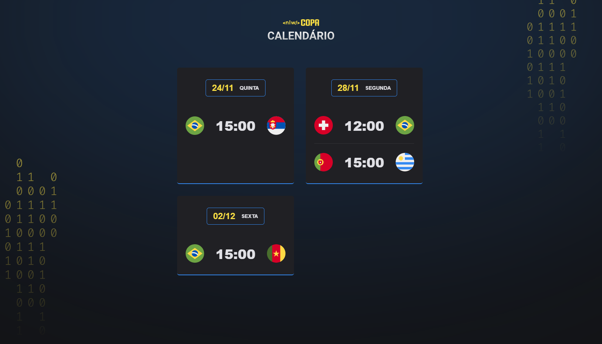

# Calendário da Copa
O Calendário da Copa é um projeto que mostra os jogos da Copa de 2022 desenvolvido durante a Next Level Week da Rocketseat. 

### Preview do Projeto

[Clique aqui para acessar](https://marqueba.github.io/nlw-copa-explorer/)

## Tecnologias Utilizadas

- ``HTML``
- ``CSS``
- ``JavaScript``
- ``Git e Github``

## Contato

| [ Marcos Reis Dutra](https://github.com/Marqueba)